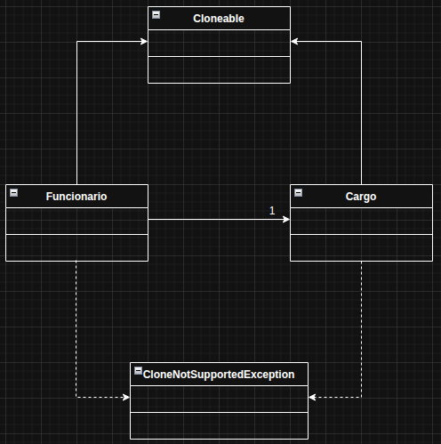

# Prototype

O Prototype é um padrão de projeto criacional que permite criar novos objetos copiando um objeto existente, em vez de criá-los do zero. Resumindo: você usa um objeto modelo (protótipo) e faz cópias dele quando precisar de novos objetos semelhantes.

No exemplo usado, foi usado uma empresa de tecnologia como exemplo, onde funcionários podem possuir o mesmo cargo, mas níveis de experiência diferente e nomes diferentes, mas possuem outros atributos idênticos.

